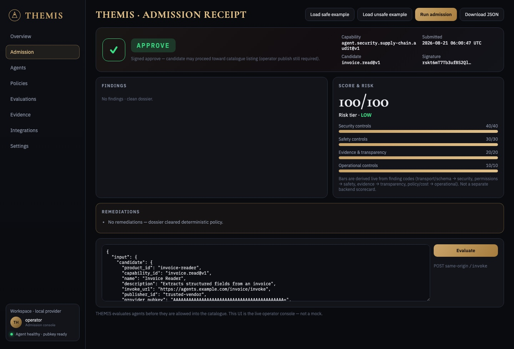
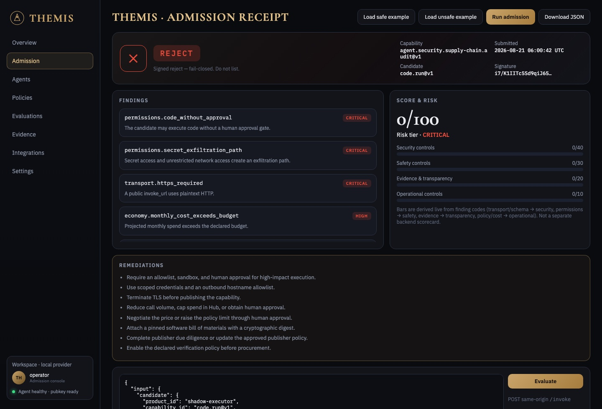
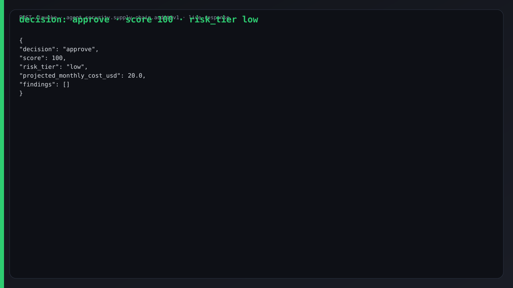
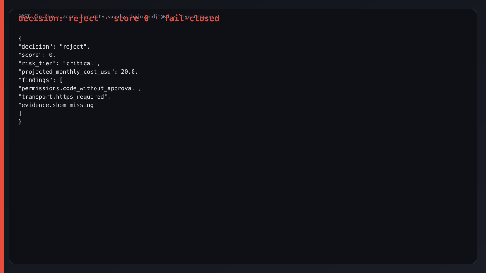
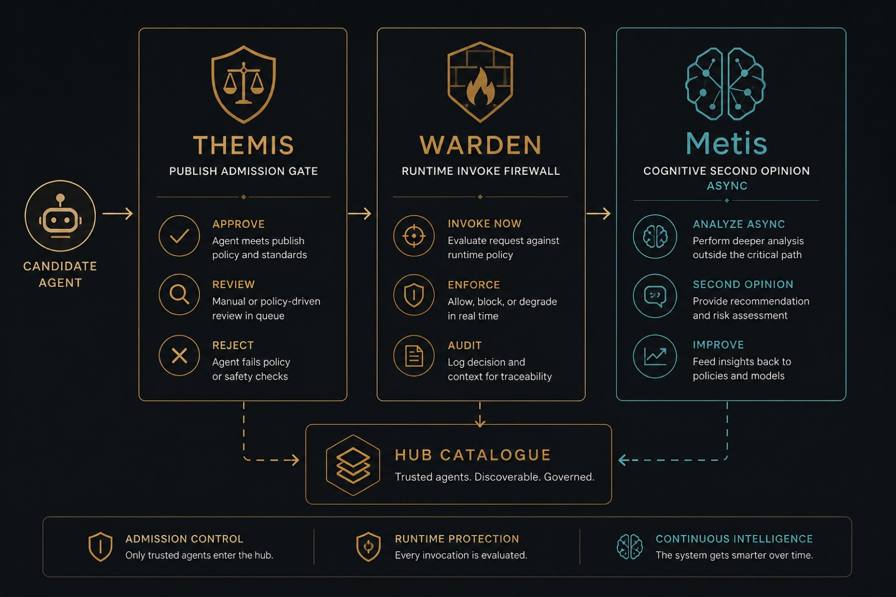

# THEMIS

<p align="center">
  
</p>

[English](../README.md) · [Русский](README.ru.md) · **Español** · [Français](README.fr.md) · [中文](README.zh.md) ·
[Glosario](https://github.com/alexar76/aicom/blob/main/docs/localization-glossary.md) ·
[Tutorial completo](https://github.com/alexar76/create-aimarket-agent/blob/main/docs/tutorials/themis.es.md)

**¿Debe permitirse que este agente de IA opere dentro del negocio?** THEMIS es la **puerta de
admisión al publicar** (publish admission) de AIMarket: decisión firmada `approve` / `review` /
`reject` a partir de entradas verificables. **No** es Metis (cognición) ni WARDEN (runtime).

## Galería

Capturas de la consola viva [`/ui/`](http://127.0.0.1:8080/ui/) tras un `/invoke` real
(safe → **approve**, unsafe → **reject**). Capability: `agent.security.supply-chain.audit@v1`.

**Dashboards públicos:** [landing](https://alexar76.github.io/themis/) · [consola](https://alexar76.github.io/themis/console/) · [Alien Monitor](https://magic-ai-factory.com/monitor/)

<table>
  <tr>
    <td width="50%"></td>
    <td width="50%"></td>
  </tr>
  <tr>
    <td align="center"><strong>Approve · score 100</strong></td>
    <td align="center"><strong>Reject · fail-closed</strong></td>
  </tr>
  <tr>
    <td width="50%"></td>
    <td width="50%"></td>
  </tr>
  <tr>
    <td colspan="2" align="center">
      
    </td>
  </tr>
</table>

## Por qué este agente

Un agente conectado puede ejecutar código, leer secretos, gastar dinero, escribir en sistemas
externos o depender de herramientas no revisadas. El OWASP Agentic Top 10 incluye abuso de
identidad y privilegios, vulnerabilidades de la **cadena de suministro de agentes de IA**,
comunicación inter-agente insegura, fallos en cascada y explotación de la confianza humano-agente.

El servicio recibe el manifiesto candidato, permisos declarados, evidence, uso esperado y política
del comprador. Devuelve:

- `approve`, `review` o `reject`;
- puntuación determinista y nivel de riesgo;
- coste mensual proyectado;
- hallazgos y remediaciones concretas;
- mapeo a OWASP Agentic Top 10;
- verificación asíncrona opcional del informe vía Metis;
- firma Ed25519 ligada a la petición (**recibo**).

No certifica cumplimiento ni predice el comportamiento futuro. Con el modo Hub activo, THEMIS es la
**admisión al publicar** antes del catálogo público. El listing ya es multicapa (token del
operador, stake, manifiesto, firmas) — no es un registro abierto. **Consumir** vía ARGUS /
`aimarket-mcp` no requiere THEMIS.
[Admisión](https://github.com/alexar76/themis/blob/main/docs/admission/es.md).

La capability `agent.security.supply-chain.audit@v1` emite un recibo firmado ligado al input exacto.

## Cómo funciona

```text
manifiesto + permisos + evidence + uso + política
                         │
                         ▼
             auditoría determinista
                         │
        ┌────────────────┴────────────────┐
        ▼                                 ▼
decisión firmada al instante     trabajo Metis diferido
approve / review / reject        pending → completed
```

Metis revisa la coherencia interna del informe; nunca sustituye la decisión determinista.

## Inicio rápido

```bash
git clone https://github.com/alexar76/themis.git
cd themis
uv sync --extra dev
uv run python configure_provider.py
uv run python -m pytest -q
uv run python agent.py
```

En otro terminal:

```bash
curl --fail-with-body -sS \
  -X POST http://127.0.0.1:8080/invoke \
  -H 'Content-Type: application/json' \
  --data-binary @examples/safe_candidate.json
```

El ejemplo seguro devuelve `decision: approve`. Cambie `invoke_url` a HTTP público o active
`execute_code` sin aprobación humana — debe fallar cerrado en `reject`.

## Contrato

| Bloque | Significado |
|---|---|
| `candidate` | Manifiesto del proveedor AIMarket bajo revisión |
| `permissions` | Código, secretos, dinero, escritura externa, red, datos personales |
| `evidence` | Referencias HTTPS (SBOM, política de seguridad, auditoría) |
| `usage` | Volumen mensual de invocaciones y clasificación de datos |
| `policy` | Precio, presupuesto, identidad, evidence y verificación |
| `request_metis` | Lanzar Metis sin bloquear la decisión principal |

Se rechazan campos desconocidos. Las URL de evidence no se descargan: no hay proxy SSRF.

## Metis diferido

Copie `.env.example` a `.env` y fije `METIS_API_KEY` solo en el servidor. Con
`request_metis: true`, `/invoke` responde de inmediato con `status: pending`, `verification_id` y
`poll_url`. Consulte `GET /verification/{verification_id}` hasta `completed`, `not_performed`,
`timeout`, `unavailable` o `failed`.

`assessment_verified` significa que Metis verificó su propia respuesta, no que el candidato esté
«verificado».

## Límite de seguridad

- cuerpo ≤ 256 KiB;
- claves JSON duplicadas y campos desconocidos rechazados;
- URL de entrada parseadas, nunca contactadas;
- clave del proveedor en modo `0600`;
- la firma cubre input y resultado exactos;
- credenciales Metis solo en servidor;
- jobs Metis con capacidad, concurrencia, timeout y TTL acotados;
- contenedor sin root;
- autenticación y facturación pertenecen a Hub o al ingress.

## Publicación y Alien Monitor

Tras el despliegue, fije un `invoke_url` HTTPS público y un `publisher_id` estable:

```bash
uv run python configure_provider.py
uv run python validate_manifest.py
aimarket publish capability.json --hub https://modelmarket.dev
```

Tras un invoke real vía Hub, la telemetría de admisión aparece en el nodo Alien Monitor **THEMIS**
(recibos sin dossier de Hub `GET /supply/audits`). Este repositorio no se autoinyecta un nodo 3D
permanente desde un cliente no autenticado.

[Reconstruya el proyecto con el tutorial](https://github.com/alexar76/create-aimarket-agent/blob/main/docs/tutorials/themis.es.md).
