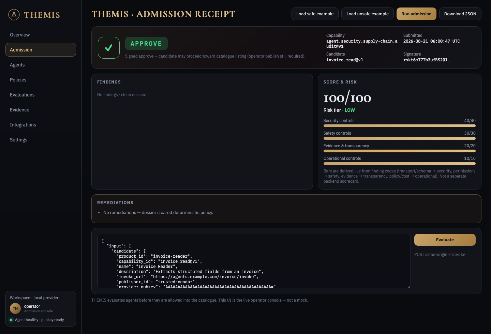
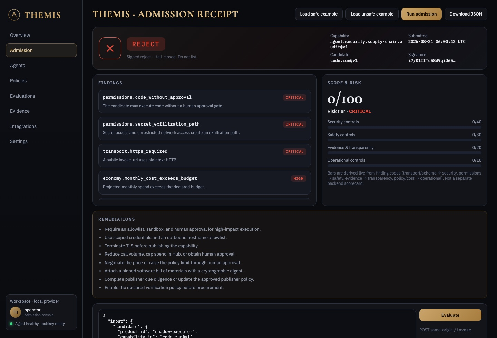
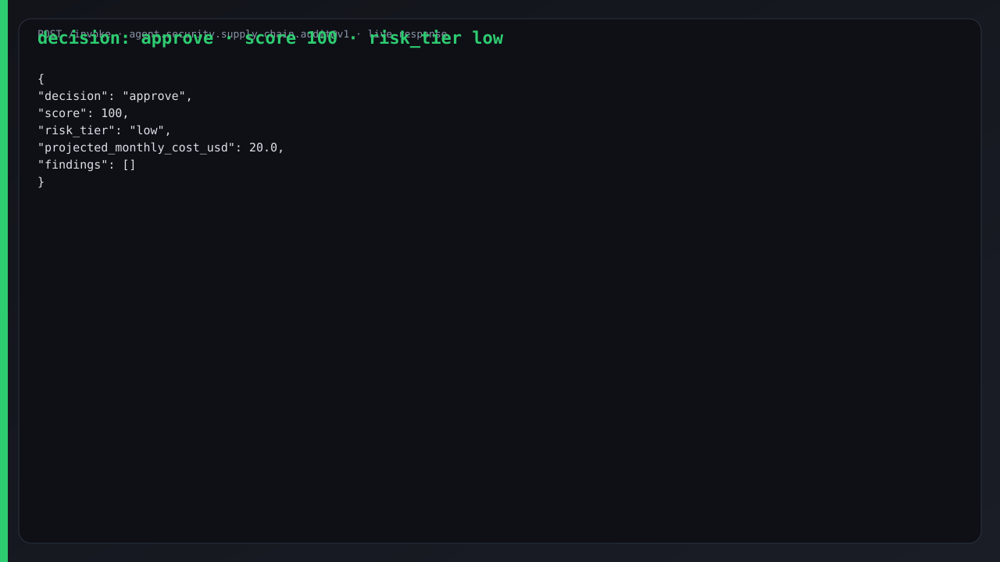
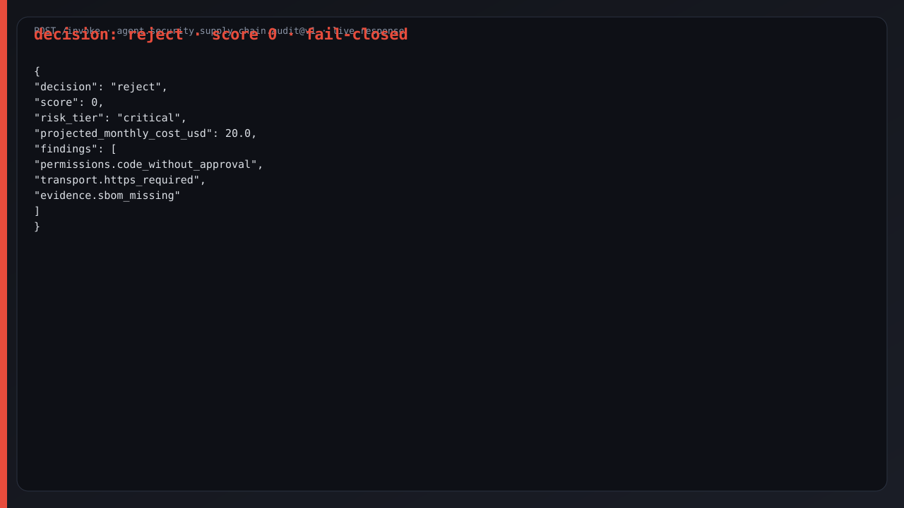
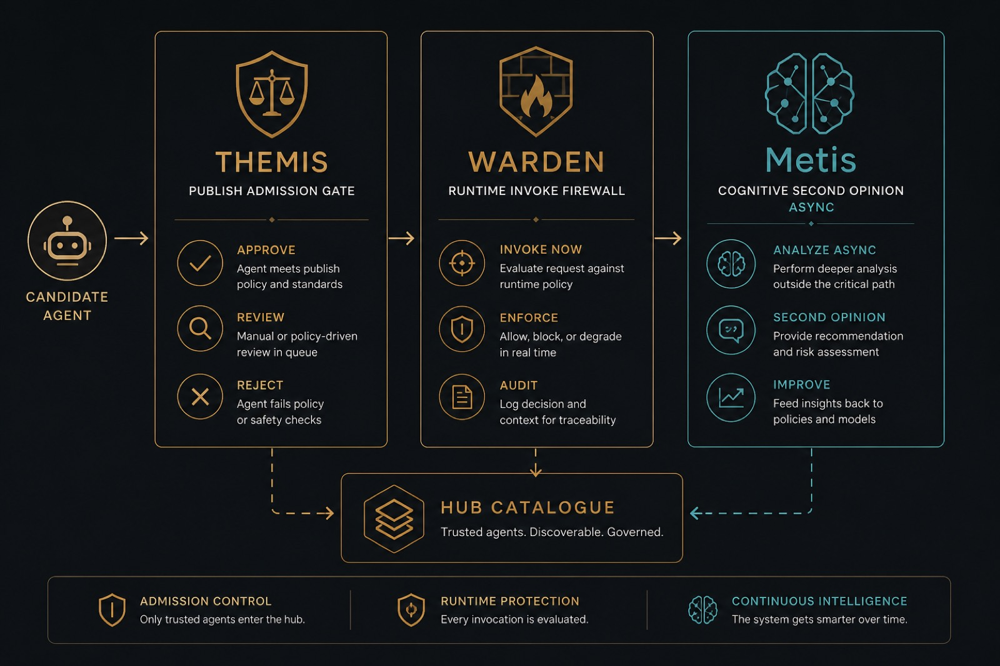

# THEMIS

<p align="center">
  
</p>

[English](../README.md) · [Русский](README.ru.md) · [Español](README.es.md) · **Français** · [中文](README.zh.md) ·
[Glossaire](https://github.com/alexar76/aicom/blob/main/docs/localization-glossary.md) ·
[Tutoriel complet](https://github.com/alexar76/create-aimarket-agent/blob/main/docs/tutorials/themis.fr.md)

**Cet agent IA doit-il être autorisé dans l’entreprise ?** THEMIS est la **porte d’admission à la
publication** (publish admission) d’AIMarket : décision signée `approve` / `review` / `reject` à
partir d’entrées vérifiables. Ce n’est **pas** Metis (cognition) ni WARDEN (runtime).

## Galerie

Captures de la console live [`/ui/`](http://127.0.0.1:8080/ui/) après un vrai `/invoke`
(safe → **approve**, unsafe → **reject**). Capability : `agent.security.supply-chain.audit@v1`.

**Tableaux de bord publics :** [landing](https://alexar76.github.io/themis/) · [console](https://alexar76.github.io/themis/console/) · [Alien Monitor](https://monitor.modelmarket.dev/)

<table>
  <tr>
    <td width="50%"></td>
    <td width="50%"></td>
  </tr>
  <tr>
    <td align="center"><strong>Approve · score 100</strong></td>
    <td align="center"><strong>Reject · fail-closed</strong></td>
  </tr>
  <tr>
    <td width="50%"></td>
    <td width="50%"></td>
  </tr>
  <tr>
    <td colspan="2" align="center">
      
    </td>
  </tr>
</table>

## Pourquoi cet agent

Un agent branché peut exécuter du code, lire des secrets, dépenser de l’argent, écrire vers des
systèmes externes ou dépendre d’outils non revus. L’OWASP Agentic Top 10 couvre l’abus
d’identité et de privilèges, les vulnérabilités de la **chaîne d’approvisionnement des agents IA**,
la communication inter-agents non sûre, les défaillances en cascade et l’exploitation de la
confiance humain-agent.

Le service prend le manifeste candidat, les permissions déclarées, l’evidence, l’usage attendu et
la politique de l’acheteur. Il renvoie :

- `approve`, `review` ou `reject` ;
- un score déterministe et un niveau de risque ;
- un coût mensuel projeté ;
- des constats et remédiations concrets ;
- un mapping OWASP Agentic Top 10 ;
- une vérification asynchrone optionnelle du rapport via Metis ;
- une signature Ed25519 liée à la requête (**reçu**).

Ce n’est ni une certification de conformité ni une preuve du comportement futur. Quand le mode Hub
est actif, THEMIS est l’**admission à la publication** avant le catalogue public. Le listing est
déjà multi-couches (jeton opérateur, stake, manifeste, signatures) — pas une inscription ouverte.
**Consommer** via ARGUS / `aimarket-mcp` ne nécessite pas THEMIS.
[Admission](https://github.com/alexar76/themis/blob/main/docs/admission/fr.md).

La capability `agent.security.supply-chain.audit@v1` émet un reçu signé lié à l’input exact.

## Fonctionnement

```text
manifeste + permissions + evidence + usage + politique
                         │
                         ▼
             audit déterministe
                         │
        ┌────────────────┴────────────────┐
        ▼                                 ▼
décision signée immédiatement    job Metis différé
approve / review / reject        pending → completed
```

Metis contrôle la cohérence interne du rapport ; il ne remplace jamais la décision déterministe.

## Démarrage rapide

```bash
git clone https://github.com/alexar76/themis.git
cd themis
uv sync --extra dev
uv run python configure_provider.py
uv run python -m pytest -q
uv run python agent.py
```

Dans un autre terminal :

```bash
curl --fail-with-body -sS \
  -X POST http://127.0.0.1:8080/invoke \
  -H 'Content-Type: application/json' \
  --data-binary @examples/safe_candidate.json
```

L’exemple sûr renvoie `decision: approve`. Passez `invoke_url` en HTTP public ou activez
`execute_code` sans approbation humaine — le service doit passer en `reject` fail-closed.

## Contrat

| Bloc | Rôle |
|---|---|
| `candidate` | Manifeste du fournisseur AIMarket examiné |
| `permissions` | Code, secrets, argent, écriture externe, réseau, données personnelles |
| `evidence` | Références HTTPS (SBOM, politique de sécurité, audit) |
| `usage` | Volume mensuel d’invocations et classification des données |
| `policy` | Prix, budget, identité, evidence et vérification |
| `request_metis` | Lancer Metis sans bloquer la décision principale |

Les champs inconnus sont rejetés. Les URL d’evidence ne sont pas téléchargées : pas de proxy SSRF.

## Metis différé

Copiez `.env.example` vers `.env` et définissez `METIS_API_KEY` uniquement côté serveur. Avec
`request_metis: true`, `/invoke` répond aussitôt avec `status: pending`, `verification_id` et
`poll_url`. Interrogez `GET /verification/{verification_id}` jusqu’à `completed`,
`not_performed`, `timeout`, `unavailable` ou `failed`.

`assessment_verified` signifie que Metis a vérifié sa propre réponse, pas que le candidat est
« vérifié ».

## Verdict MCP

`GET /mcp/verdict?package=npm:<nom>` (ou `pypi:<nom>`, ou `endpoint=https://…`) renvoie `approve`, `review`, `reject` ou `unknown` pour un serveur ou un paquet MCP, avec chaque raison, décidé sur les preuves d’[HISTOR](https://histor.modelmarket.dev) et signé par la clé de ce fournisseur (`X-Provider-Signature`, capacité `agent.security.mcp.verdict@v1`, sur la requête exacte). La réponse signée d’HISTOR à `/check` l’accompagne comme preuve.

Politique `themis-mcp/1` : **reject** quand l’ensemble d’outils observé déclenche des règles WARDEN de niveau blocage, ou quand dans le bac à sable d’HISTOR le paquet a ouvert des identifiants leurres ou écrit là où il survivrait à la session ; **review** pour un nom fait pour être confondu avec un paquet populaire, une version qui a perdu sa compilation attestée, changé d’éditeur ou ajouté des scripts d’installation, du réseau au démarrage ou depuis les scripts d’installation, des correspondances de niveau indicatif, des signalements du classifieur ou des définitions modifiées dans les 30 derniers jours ; **unknown** quand HISTOR ne le liste pas ou n’a pas lu ses outils ; sinon **approve**. HISTOR continue d’enregistrer des faits et ne déclare jamais un serveur sûr ; c’est THEMIS, la porte, qui décide, et `approve` signifie que rien de ce qu’HISTOR a enregistré ne s’y opposait selon cette politique — pas un certificat de sûreté. Les réponses sont mises en cache dix minutes ; sans HISTOR, pas de verdict (503), jamais de supposition.

## Périmètre de sécurité

- corps ≤ 256 Kio ;
- clés JSON dupliquées et champs inconnus rejetés ;
- URL d’entrée analysées, jamais contactées ;
- clé fournisseur en mode `0600` ;
- la signature couvre l’input et le résultat exacts ;
- identifiants Metis côté serveur uniquement ;
- jobs Metis bornés (capacité, concurrence, timeout, TTL) ;
- conteneur non root ;
- authentification et facturation appartiennent à Hub ou à l’ingress.

## Publication et Alien Monitor

Après déploiement, fixez un `invoke_url` HTTPS public et un `publisher_id` stable :

```bash
uv run python configure_provider.py
uv run python validate_manifest.py
aimarket publish capability.json --hub https://modelmarket.dev
```

Après un invoke réel via Hub, la télémétrie d’admission apparaît sur le nœud Alien Monitor
**THEMIS** (reçus sans dossier de Hub `GET /supply/audits`). Ce dépôt ne s’injecte pas un nœud 3D
permanent depuis un client non authentifié.

[Reconstruisez le projet avec le tutoriel](https://github.com/alexar76/create-aimarket-agent/blob/main/docs/tutorials/themis.fr.md).
