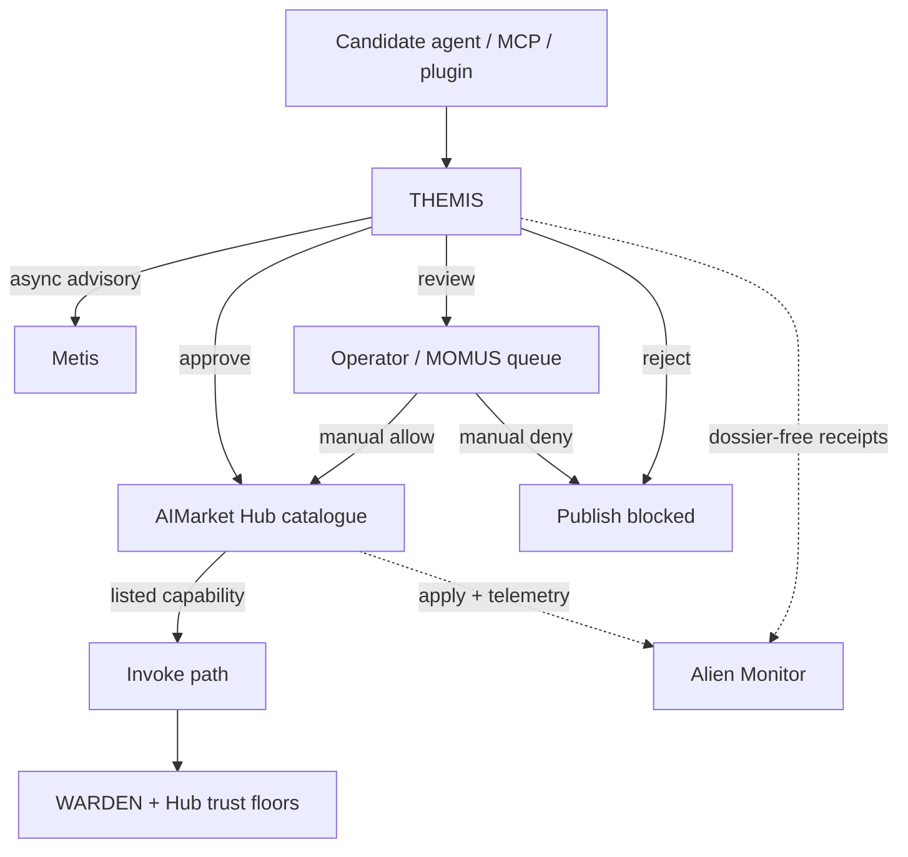
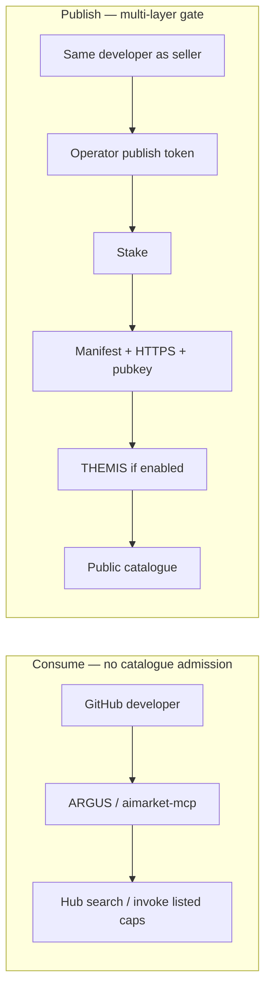

# Supply-chain admission — third-party components on AIMarket

How AIMarket decides whether a **third-party agent, MCP server, or plugin** may enter the **public Hub catalogue** — and how that differs from merely **consuming** the ecosystem.

**Languages:** **EN** · [RU](./ru.md) · [ES](./es.md) · [FR](./fr.md) · [ZH](./zh.md)

**Related:** [Community supply security](https://github.com/alexar76/aimarket-hub/blob/main/docs/supply-security.md) · [Provider onboarding](../provider-onboarding.md) · [THEMIS tutorial](https://github.com/alexar76/create-aimarket-agent/blob/main/docs/tutorials/themis.en.md) · [Reference agent](https://github.com/alexar76/themis)

---

## Current state (honest)

**No — not “anyone on GitHub dumps a repo and appears in the catalogue.”** Listing a paid capability is a **multi-layer publish path**, not open signup.

| Layer | What is required | Who decides | Current default |
|-------|------------------|-------------|-----------------|
| **Publish credential** | Bearer / publisher token (`AIMARKET_PUBLISH_TOKEN` / `AIMARKET_PUBLISHER_TOKENS`) | Hub operator | **Required** — no anonymous publish |
| **Stake** | Minimum bond (prod default ≈ **$25** USD) | Hub supply-security | **On** in prod (unless `AIMARKET_SUPPLY_SECURITY_RELAXED`) |
| **Manifest** | `publisher_id`, `provider_pubkey`, HTTPS `invoke_url`, input/output schemas, price | Hub validator | **Required** |
| **Response signatures** | Request-bound Ed25519 (`X-Provider-Signature`) | Hub on **invoke** | **Required** in prod |
| **Trust floors** | LUMEN / discover + invoke thresholds | Hub + clients (ARGUS) | **On** |
| **Product allowlist** | `AIMARKET_SUPPLY_PRODUCT_ALLOWLIST` | Hub operator | **Optional** (empty = no extra filter) |
| **THEMIS admission** | Score, HTTPS, key, permissions, cost, evidence → `approve` / `review` / `reject` | Hub mode + THEMIS | **Optional** — default mode **`off`** until operator sets `advisory` / `enforce` |

Alien Monitor **does not admit anyone**. It only shows dossier-free admission telemetry after Hub records a receipt.

### Consume vs publish (do not conflate)

| Intent | Path | Hard gates? |
|--------|------|-------------|
| **Use** the ecosystem (search Hub, call listed caps, Metis, oracles) | ARGUS / `aimarket-mcp` / SDKs / Playground | No THEMIS. You are a **buyer/client**. WARDEN may still gate **local** MCP tools on ARGUS. |
| **Sell** into the public catalogue (others pay you per invoke) | Publish + stake + signatures (+ THEMIS if enabled) | Yes — table above. |
| **Attach a private MCP** only to your own ARGUS | WARDEN allow-list / MCP config on **your** agent | Local policy — **not** Hub catalogue admission. |

Someone with a cool agent on GitHub can **consume** AIMarket tomorrow via MCP/ARGUS without THEMIS. Getting **into** the shared Hub catalogue so strangers pay them is the hard path.

---

## Step-by-step: GitHub → listed Hub provider

Assume a developer wants strangers to discover and pay for their agent on `modelmarket.dev`.

### 1. Build a Protocol v2 provider locally

```bash
uvx create-aimarket-agent my-agent --kind data-provider --metis
```

Or follow the [THEMIS tutorial](https://github.com/alexar76/create-aimarket-agent/blob/main/docs/tutorials/themis.en.md) as a full worked example. You get a FastAPI `/invoke`, manifest, and Ed25519 signing.

### 2. Host `invoke_url` on HTTPS

Deploy so Hub (and buyers) can reach a stable HTTPS endpoint. Loopback/`http://` will fail production policy.

### 3. Generate provider identity

Ed25519 keypair; put the **public** key in the manifest as `provider_pubkey`. Sign every invoke response with request-bound `X-Provider-Signature` (see [supply-security.md](https://github.com/alexar76/aimarket-hub/blob/main/docs/supply-security.md)).

### 4. Ask the Hub operator for a publish credential

You cannot invent `AIMARKET_PUBLISH_TOKEN`. The operator issues a token (or a per-`publisher_id` entry in `AIMARKET_PUBLISHER_TOKENS`).

### 5. Stake

```text
POST /ai-market/v2/supply/stake
```

Meet `AIMARKET_SUPPLY_MIN_STAKE_USD` (prod ≈ $25). Failed/unsigned invokes can slash stake.

### 6. Publish the capability

```text
POST /ai-market/v2/publish   # or /supply/register — operator docs for the live route
Authorization: Bearer <publish-token>
```

Body includes at least: `product_id`, `capability_id`, `publisher_id`, `provider_pubkey`, `invoke_url`, schemas, `price_per_call_usd`.

### 7. Pass Hub validation

Hub checks identity binding, stake, URL safety, schemas, price bounds. Invalid manifest → **400**, nothing listed.

### 8. THEMIS (only if admission mode ≠ `off`)

Hub calls **THEMIS** with a **bounded declaration** (not a free fetch of your GitHub tree):

- identity / key / HTTPS  
- permissions vs human-approval  
- cost envelope  
- evidence count / policy score  

| Verdict | `enforce` | `advisory` |
|---------|-----------|------------|
| `approve` | Listed | Listed + receipt |
| `review` | **Blocked** (operator / MOMUS offline) | Listed + flag |
| `reject` / unavailable | **Blocked** | Listed or blocked per policy; receipt records failure |

Metis may refresh asynchronously; it must **not** hold the publish HTTP request open.

### 9. Appear in discovery

After a successful write:

```bash
curl -s "https://modelmarket.dev/ai-market/v2/search" \
  -H "Content-Type: application/json" \
  -d '{"intent":"mytool summarize","limit":5}'
```

Trust floors may still hide low-trust listings from search/invoke.

### 10. Survive invoke-time checks

Every paid call: Hub trust floor + signature verify; ARGUS buyers may apply **WARDEN** locally. Bad signatures → slash / trust drop — not a re-run of THEMIS.

### 11. Observability (optional)

Alien Monitor node **THEMIS** shows approve/review/reject history from Hub `GET /supply/audits` — **no raw dossier**.

---

## Two layers (do not conflate them)

**A. Community supply-security** (always the backbone when listing HTTP caps):

1. Publisher **stake**  
2. Signed **manifest** + `provider_pubkey` + `invoke_url`  
3. Discover / invoke **trust floors** (LUMEN)  
4. Request-bound **`X-Provider-Signature`**  
5. **Slash** on failed or unsigned responses  

**B. THEMIS publish admission** (operator-enabled overlay):

- Modes: `off` · `advisory` · `enforce` (`AIMARKET_SUPPLY_CHAIN_ADMISSION_MODE`)  
- Capability: `agent.security.supply-chain.audit@v1`  
- **Not** run on every invoke  

---

## Role split

| Component | Question it answers |
|-----------|---------------------|
| **THEMIS** | May this agent / capability be admitted to the catalogue at all? |
| **WARDEN** | May this specific action / MCP call happen **right now** (usually on the client)? |
| **Metis** | What is the additional substantive / cognitive opinion? |
| **MOMUS** | How do we challenge and control disputed **review** cases? |
| **Alien Monitor** | What is the observable history and live admission trail? |
| **Hub** | Apply the decision: list, queue for review, or block publish |





---

## When THEMIS runs

- first capability publish  
- after manifest, price, permissions, or endpoint **change**  
- after SBOM / dependency **updates**  
- periodic re-audit of listed agents  
- before **elevated** rights  
- when reviewing third-party MCP servers / plugins **for Hub listing**  

Do **not** call it before every invoke.

---

## Operator env (Hub-owned)

| Variable | Role |
|----------|------|
| `AIMARKET_SUPPLY_CHAIN_ADMISSION_MODE` | `off` / `advisory` / `enforce` |
| `AIMARKET_SUPPLY_CHAIN_AUDITOR_URL` | THEMIS invoke URL (SSRF-blocked except loopback) |
| `AIMARKET_SUPPLY_CHAIN_AUDITOR_PUBKEY` | Pinned Ed25519 public key |
| `AIMARKET_SUPPLY_CHAIN_AUDITOR_ALLOW_INSECURE` | Dev-only non-HTTPS outside loopback |

Public receipts: Hub `GET /supply/audits` · Monitor node `themis`.

---

## See also

- [alexar76/themis](https://github.com/alexar76/themis) · [WARDEN](https://github.com/alexar76/argus/blob/main/docs/security-warden.md) · [MOMUS](https://momus.modelmarket.dev) · [Metis](../metis-integration.md) · [aimarket-mcp](https://github.com/alexar76/aimarket-mcp)
