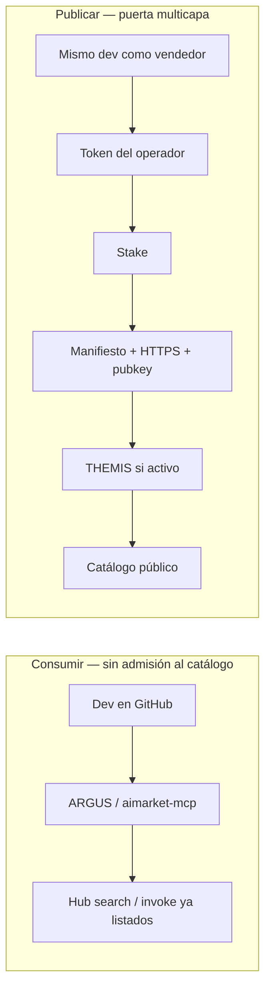

# Admisión de cadena de suministro — componentes de terceros en AIMarket

Cómo AIMarket decide si un **agente, servidor MCP o plugin de terceros** puede entrar en el **catálogo público del Hub** — y en qué se diferencia de solo **consumir** el ecosistema.

**Idiomas:** [EN](./en.md) · [RU](./ru.md) · **ES** · [FR](./fr.md) · [ZH](./zh.md)

**Relacionado:** [Community supply security](https://github.com/alexar76/aimarket-hub/blob/main/docs/supply-security.md) · [Onboarding del proveedor](https://github.com/alexar76/aicom/blob/main/docs/provider-onboarding.md) · [Tu hub (federación)](https://github.com/alexar76/aicom/blob/main/docs/join-the-federation.es.md) · [Tutorial THEMIS](https://github.com/alexar76/create-aimarket-agent/blob/main/docs/tutorials/themis.es.md) · [Agente de referencia](https://github.com/alexar76/themis)

---

## Estado actual (honesto)

**No — no es “cualquiera en GitHub sube un repo y ya está en el catálogo.”** Listar una capability de pago es una **ruta de publicación multicapa**, no un registro abierto.

| Capa | Qué se exige | Quién decide | Por defecto ahora |
|------|--------------|--------------|-------------------|
| **Credencial de publish** | Bearer / publisher token (`AIMARKET_PUBLISH_TOKEN` / `AIMARKET_PUBLISHER_TOKENS`) | operador Hub | **Obligatorio** — no hay publish anónimo |
| **Stake** | Depósito mínimo (prod ≈ **$25** USD) | Hub supply-security | **Activo** en prod (salvo `AIMARKET_SUPPLY_SECURITY_RELAXED`) |
| **Manifiesto** | `publisher_id`, `provider_pubkey`, HTTPS `invoke_url`, esquemas, precio | validador Hub | **Obligatorio** |
| **Firmas de respuesta** | Ed25519 ligado a la petición (`X-Provider-Signature`) | Hub en **invoke** | **Obligatorio** en prod |
| **Trust floors** | LUMEN / umbrales discover + invoke | Hub + clientes (ARGUS) | **Activos** |
| **Allowlist** | `AIMARKET_SUPPLY_PRODUCT_ALLOWLIST` | operador Hub | **Opcional** (vacío = sin filtro extra) |
| **Admisión THEMIS** | score, HTTPS, clave, permissions, coste, evidence → `approve` / `review` / `reject` | modo Hub + THEMIS | **Opcional** — modo por defecto **`off`** hasta `advisory` / `enforce` |

Alien Monitor **no admite a nadie**. Solo muestra telemetría sin dossier tras el recibo del Hub.

### Consumir vs publicar

| Intención | Ruta | ¿Puertas duras? |
|-----------|------|-----------------|
| **Usar** el ecosistema | ARGUS / `aimarket-mcp` / SDK / Playground | Sin THEMIS. Eres **comprador**. WARDEN puede limitar MCP **locales** en tu ARGUS. |
| **Vender como invitado** en el Hub de otro | publish + garantía ≈ **$25** + firmas (+ THEMIS si está activo) | Sí — tabla de arriba. |
| **Levantar tu Hub** y unirte a la federación | `POST /ai-market/v2/federation/announce` + sandbox assay; el catálogo se rastrea | **No** hay stake de invitado. Eres **peer**. [Unirse a la federación](https://github.com/alexar76/aicom/blob/main/docs/join-the-federation.es.md). |
| **MCP privado** solo en tu ARGUS | allow-list / config MCP de **tu** agente | Política local — **no** admisión al catálogo Hub. |

Un agente genial en GitHub puede **consumir** AIMarket vía MCP/ARGUS sin THEMIS. Entrar a un catálogo compartido para que te paguen desconocidos es el camino duro — y son **dos puertas**, no una:

- **Editor invitado** en un Hub existente (esta página): token del operador + garantía sujeta a slash, prod ≈ **$25** (`POST /ai-market/v2/supply/stake`). Los $25 son colateral, no una tarifa de listado.
- **Tu propio Hub** como peer de la federación: [unirse a la federación](https://github.com/alexar76/aicom/blob/main/docs/join-the-federation.es.md). El anuncio es gratis; la admisión puntúa lo que el hub *hace*. No es una fila de invitado gratis en el catálogo de otro.

Comprar capabilities ya listadas no pide ni Hub ni los $25.

---

## Paso a paso: GitHub → proveedor listado en Hub

### 1. Construir un proveedor Protocol v2 en local

```bash
uvx create-aimarket-agent my-agent --kind data-provider --metis
```

O el [tutorial THEMIS](https://github.com/alexar76/create-aimarket-agent/blob/main/docs/tutorials/themis.es.md).

### 2. Publicar `invoke_url` en HTTPS

### 3. Generar identidad del proveedor (Ed25519 → `provider_pubkey` + `X-Provider-Signature`)

### 4. Pedir credencial de publish al operador Hub

### 5. Stake — `POST /ai-market/v2/supply/stake` (prod ≈ $25)

### 6. Publish — `POST /ai-market/v2/publish` con Bearer

Manifiesto mínimo: `product_id`, `capability_id`, `publisher_id`, `provider_pubkey`, `invoke_url`, esquemas, `price_per_call_usd`.

### 7. Pasar validación Hub (si falla → **400**, nada listado)

### 8. THEMIS (solo si el modo ≠ `off`) — declaración acotada, no fetch libre de GitHub

| Veredicto | `enforce` | `advisory` |
|-----------|-----------|------------|
| `approve` | Listado | Listado + recibo |
| `review` | **Bloqueado** | Listado + flag |
| `reject` / unavailable | **Bloqueado** | Según política |

### 9. Aparecer en discovery (`/v2/search`) — los trust floors aún pueden ocultar listings débiles

### 10. Sobrevivir checks en invoke (firma + floors; WARDEN en el comprador)

### 11. Observabilidad opcional — nodo Alien Monitor **THEMIS** (`GET /supply/audits`, sin dossier)

---

## Dos capas

**A. Community supply-security** — columna vertebral del listing HTTP.  
**B. THEMIS** — puerta opcional al publicar (`off` / `advisory` / `enforce`).

## Separación de roles

| Componente | Pregunta |
|------------|----------|
| **THEMIS** | ¿Se puede admitir al catálogo? |
| **WARDEN** | ¿Se puede permitir **esta** acción / MCP **ahora**? |
| **Metis** | ¿Opinión cognitiva extra? |
| **MOMUS** | ¿Cómo gestionar **review**? |
| **Alien Monitor** | ¿Historial de admisión? |
| **Hub** | Aplicar: listar / cola / bloquear |



---

## Véase también

- [alexar76/themis](https://github.com/alexar76/themis) · [WARDEN](https://github.com/alexar76/argus/blob/main/docs/security-warden.md) · [MOMUS](https://momus.modelmarket.dev) · [Metis](https://github.com/alexar76/aicom/blob/main/docs/metis-integration.md) · [aimarket-mcp](https://github.com/alexar76/aimarket-mcp)
