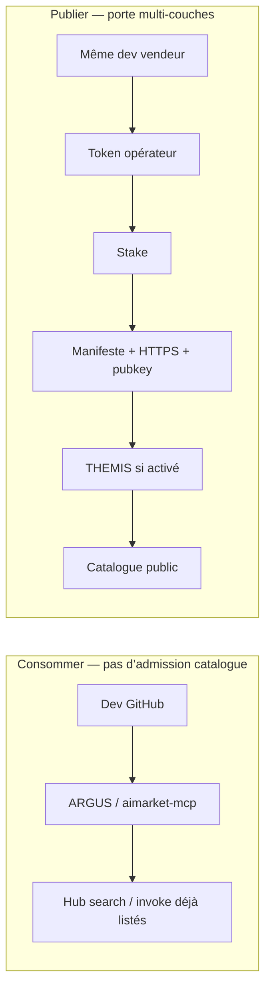

# Admission chaîne d’approvisionnement — composants tiers sur AIMarket

Comment AIMarket décide si un **agent, serveur MCP ou plugin tiers** peut entrer dans le **catalogue public Hub** — et en quoi cela diffère de simplement **consommer** l’écosystème.

**Langues :** [EN](./en.md) · [RU](./ru.md) · [ES](./es.md) · **FR** · [ZH](./zh.md)

**Liens :** [Community supply security](https://github.com/alexar76/aimarket-hub/blob/main/docs/supply-security.md) · [Onboarding fournisseur](../provider-onboarding.md) · [Tutoriel THEMIS](https://github.com/alexar76/create-aimarket-agent/blob/main/docs/tutorials/themis.fr.md) · [Agent de référence](https://github.com/alexar76/themis)

---

## État actuel (honnête)

**Non — ce n’est pas « n’importe qui sur GitHub pousse un dépôt et apparaît au catalogue. »** Lister une capability payante est un **chemin de publication multi-couches**, pas une inscription ouverte.

| Couche | Exigence | Qui décide | Défaut actuel |
|--------|----------|------------|---------------|
| **Credentiel publish** | Bearer / publisher token (`AIMARKET_PUBLISH_TOKEN` / `AIMARKET_PUBLISHER_TOKENS`) | opérateur Hub | **Obligatoire** — pas de publish anonyme |
| **Stake** | Caution minimale (prod ≈ **$25** USD) | Hub supply-security | **Actif** en prod (sauf `AIMARKET_SUPPLY_SECURITY_RELAXED`) |
| **Manifeste** | `publisher_id`, `provider_pubkey`, HTTPS `invoke_url`, schémas, prix | validateur Hub | **Obligatoire** |
| **Signatures de réponse** | Ed25519 lié à la requête (`X-Provider-Signature`) | Hub à l’**invoke** | **Obligatoire** en prod |
| **Trust floors** | LUMEN / seuils discover + invoke | Hub + clients (ARGUS) | **Actifs** |
| **Allowlist** | `AIMARKET_SUPPLY_PRODUCT_ALLOWLIST` | opérateur Hub | **Optionnel** (vide = pas de filtre extra) |
| **Admission THEMIS** | score, HTTPS, clé, permissions, coût, evidence → `approve` / `review` / `reject` | mode Hub + THEMIS | **Optionnel** — mode par défaut **`off`** jusqu’à `advisory` / `enforce` |

Alien Monitor **n’admet personne**. Il n’affiche que la télémétrie sans dossier après le reçu Hub.

### Consommer vs publier

| Intention | Chemin | Portes dures ? |
|-----------|--------|----------------|
| **Utiliser** l’écosystème | ARGUS / `aimarket-mcp` / SDK / Playground | Pas de THEMIS. Vous êtes **acheteur**. WARDEN peut limiter les MCP **locaux** sur votre ARGUS. |
| **Vendre** au catalogue public | publish + stake + signatures (+ THEMIS si activé) | Oui — tableau ci-dessus. |
| **MCP privé** uniquement sur votre ARGUS | allow-list / config MCP de **votre** agent | Politique locale — **pas** l’admission catalogue Hub. |

Un agent brillant sur GitHub peut **consommer** AIMarket via MCP/ARGUS sans THEMIS. Entrer dans le catalogue partagé pour être payé par des inconnus est le chemin dur.

---

## Étape par étape : GitHub → fournisseur listé au Hub

### 1. Construire un fournisseur Protocol v2 en local

```bash
uvx create-aimarket-agent my-agent --kind data-provider --metis
```

Ou le [tutoriel THEMIS](https://github.com/alexar76/create-aimarket-agent/blob/main/docs/tutorials/themis.fr.md).

### 2. Héberger `invoke_url` en HTTPS

### 3. Générer l’identité fournisseur (Ed25519 → `provider_pubkey` + `X-Provider-Signature`)

### 4. Demander le credentiel publish à l’opérateur Hub

### 5. Stake — `POST /ai-market/v2/supply/stake` (prod ≈ $25)

### 6. Publish — `POST /ai-market/v2/publish` avec Bearer

Manifeste minimal : `product_id`, `capability_id`, `publisher_id`, `provider_pubkey`, `invoke_url`, schémas, `price_per_call_usd`.

### 7. Passer la validation Hub (échec → **400**, rien listé)

### 8. THEMIS (seulement si mode ≠ `off`) — déclaration bornée, pas de fetch libre de GitHub

| Verdict | `enforce` | `advisory` |
|---------|-----------|------------|
| `approve` | Listé | Listé + reçu |
| `review` | **Bloqué** | Listé + flag |
| `reject` / unavailable | **Bloqué** | Selon politique |

### 9. Apparaître en discovery (`/v2/search`) — les trust floors peuvent encore masquer les listings faibles

### 10. Survivre aux contrôles à l’invoke (signature + floors ; WARDEN chez l’acheteur)

### 11. Observabilité optionnelle — nœud Alien Monitor **THEMIS** (`GET /supply/audits`, sans dossier)

---

## Deux couches

**A. Community supply-security** — ossature du listing HTTP.  
**B. THEMIS** — porte optionnelle à la publication (`off` / `advisory` / `enforce`).

## Séparation des rôles

| Composant | Question |
|-----------|----------|
| **THEMIS** | Peut-on admettre au catalogue ? |
| **WARDEN** | Cette action / ce MCP peut-il passer **maintenant** ? |
| **Metis** | Avis cognitif supplémentaire ? |
| **MOMUS** | Comment traiter les **review** ? |
| **Alien Monitor** | Historique d’admission ? |
| **Hub** | Appliquer : lister / file / bloquer |



---

## Voir aussi

- [alexar76/themis](https://github.com/alexar76/themis) · [WARDEN](https://github.com/alexar76/argus/blob/main/docs/security-warden.md) · [MOMUS](https://momus.modelmarket.dev) · [Metis](../metis-integration.md) · [aimarket-mcp](https://github.com/alexar76/aimarket-mcp)
