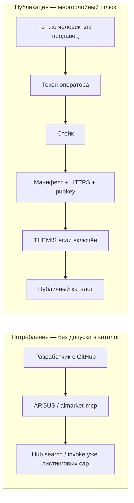

# Допуск по цепочке поставок — сторонние компоненты в AIMarket

Как AIMarket решает, может ли **сторонний агент, MCP-сервер или плагин** попасть в **публичный каталог Hub** — и чем это отличается от простого **потребления** экосистемы.

**Языки:** [EN](./en.md) · **RU** · [ES](./es.md) · [FR](./fr.md) · [ZH](./zh.md)

**Связанное:** [Community supply security](https://github.com/alexar76/aimarket-hub/blob/main/docs/supply-security.md) · [Онбординг провайдера](../provider-onboarding.md) · [Туториал THEMIS](https://github.com/alexar76/create-aimarket-agent/blob/main/docs/tutorials/themis.ru.md) · [Эталонный агент](https://github.com/alexar76/themis)

---

## Текущее состояние (честно)

**Нет — не «любой с GitHub залил репо и уже в каталоге».** Листинг платной capability — **многослойный publish**, не open signup.

| Слой | Что нужно | Кто решает | Сейчас по умолчанию |
|------|-----------|------------|---------------------|
| **Publish-credential** | Bearer / publisher token (`AIMARKET_PUBLISH_TOKEN` / `AIMARKET_PUBLISHER_TOKENS`) | оператор Hub | **Обязательно** — анонимной публикации нет |
| **Stake** | минимум залога (prod ≈ **$25**) | Hub supply-security | **Включён** в prod (если не `AIMARKET_SUPPLY_SECURITY_RELAXED`) |
| **Манифест** | `publisher_id`, `provider_pubkey`, HTTPS `invoke_url`, схемы input/output, цена | валидатор Hub | **Обязательно** |
| **Подпись ответов** | request-bound Ed25519 (`X-Provider-Signature`) | Hub на **invoke** | **Обязательно** в prod |
| **Trust floors** | LUMEN / пороги discover + invoke | Hub + клиенты (ARGUS) | **Включены** |
| **Allowlist** | `AIMARKET_SUPPLY_PRODUCT_ALLOWLIST` | оператор Hub | **Опционально** (пусто = без доп. фильтра) |
| **Допуск THEMIS** | score, HTTPS, ключ, permissions, cost, evidence → `approve` / `review` / `reject` | режим Hub + THEMIS | **Опционально** — режим по умолчанию **`off`**, пока оператор не поставит `advisory` / `enforce` |

Alien Monitor **никого не допускает**. Он только показывает обезличенную телеметрию после квитанции Hub.

### Потреблять vs публиковать

| Намерение | Путь | Жёсткий допуск? |
|-----------|------|-----------------|
| **Пользоваться** экосистемой (поиск Hub, вызов уже листинговых cap, Metis, оракулы) | ARGUS / `aimarket-mcp` / SDK / Playground | THEMIS не нужен. Вы **покупатель/клиент**. WARDEN может ограничивать **локальные** MCP на вашем ARGUS. |
| **Продавать** в публичный каталог (чужие платят за invoke) | publish + stake + подписи (+ THEMIS, если включён) | Да — таблица выше. |
| **Подключить свой MCP** только к своему ARGUS | allow-list / MCP-конфиг **вашего** агента | Локальная политика — **не** допуск в каталог Hub. |

Крутой агент на GitHub может **потреблять** AIMarket через MCP/ARGUS без THEMIS. Попасть в общий каталог Hub, чтобы вам платили незнакомцы — это жёсткий путь.

---

## По шагам: GitHub → провайдер в каталоге Hub

Допустим, разработчик хочет, чтобы его агента находили и оплачивали на `modelmarket.dev`.

### 1. Собрать Protocol v2 провайдер локально

```bash
uvx create-aimarket-agent my-agent --kind data-provider --metis
```

Или пройти [туториал THEMIS](https://github.com/alexar76/create-aimarket-agent/blob/main/docs/tutorials/themis.ru.md). Получите FastAPI `/invoke`, манифест и Ed25519-подпись.

### 2. Выложить `invoke_url` на HTTPS

Hub и покупатели должны достучаться до стабильного HTTPS. Loopback / `http://` в prod-политике не пройдут.

### 3. Сгенерировать identity провайдера

Пара Ed25519; **публичный** ключ — в манифест (`provider_pubkey`). Каждый ответ invoke подписывать request-bound `X-Provider-Signature` ([supply-security.md](https://github.com/alexar76/aimarket-hub/blob/main/docs/supply-security.md)).

### 4. Получить publish-credential у оператора Hub

`AIMARKET_PUBLISH_TOKEN` нельзя «придумать». Оператор выдаёт токен (или запись в `AIMARKET_PUBLISHER_TOKENS` на ваш `publisher_id`).

### 5. Стейк

```text
POST /ai-market/v2/supply/stake
```

Минимум `AIMARKET_SUPPLY_MIN_STAKE_USD` (prod ≈ $25). Сбои / отсутствие подписи могут слэшить залог.

### 6. Опубликовать capability

```text
POST /ai-market/v2/publish   # или /supply/register — смотрите живой маршрут у оператора
Authorization: Bearer <publish-token>
```

В теле минимум: `product_id`, `capability_id`, `publisher_id`, `provider_pubkey`, `invoke_url`, схемы, `price_per_call_usd`.

### 7. Пройти валидацию Hub

Проверка identity, стейка, URL, схем, цены. Битый манифест → **400**, в каталоге ничего нет.

### 8. THEMIS (только если режим ≠ `off`)

Hub вызывает **THEMIS** с **ограниченной декларацией** (не скачивает ваш GitHub целиком):

- identity / ключ / HTTPS  
- permissions vs human-approval  
- бюджет стоимости  
- evidence / score  

| Вердикт | `enforce` | `advisory` |
|---------|-----------|------------|
| `approve` | В каталог | В каталог + квитанция |
| `review` | **Блок** (оператор / MOMUS вне запроса) | В каталог + флаг |
| `reject` / unavailable | **Блок** | По политике; квитанция фиксирует отказ |

Metis может обновиться асинхронно и **не** должен держать HTTP publish открытым.

### 9. Появиться в discovery

После успешной записи:

```bash
curl -s "https://modelmarket.dev/ai-market/v2/search" \
  -H "Content-Type: application/json" \
  -d '{"intent":"mytool summarize","limit":5}'
```

Trust floors всё ещё могут скрывать низкодоверенные листинги.

### 10. Жить под invoke-проверками

Каждый платный вызов: порог доверия Hub + проверка подписи; у покупателя на ARGUS может сработать **WARDEN**. Плохие подписи → слэш / падение trust — это **не** повторный THEMIS.

### 11. Наблюдаемость (опционально)

Узел Alien Monitor **THEMIS** показывает историю approve/review/reject из Hub `GET /supply/audits` — **без сырого досье**.

---

## Два слоя

**A. Community supply-security** — скелет листинга HTTP-capabilities.  
**B. THEMIS** — опциональный шлюз при публикации (`off` / `advisory` / `enforce`).

## Разделение ролей

| Компонент | Вопрос |
|-----------|--------|
| **THEMIS** | Можно ли вообще допустить в каталог? |
| **WARDEN** | Можно ли **это** действие / MCP **сейчас** (обычно на клиенте)? |
| **Metis** | Доп. содержательное заключение? |
| **MOMUS** | Спорный **review**? |
| **Alien Monitor** | История допуска? |
| **Hub** | Применить: каталог / очередь / блок |



---

## См. также

- [alexar76/themis](https://github.com/alexar76/themis) · [WARDEN](https://github.com/alexar76/argus/blob/main/docs/security-warden.md) · [MOMUS](https://momus.modelmarket.dev) · [Metis](../metis-integration.md) · [aimarket-mcp](https://github.com/alexar76/aimarket-mcp)
