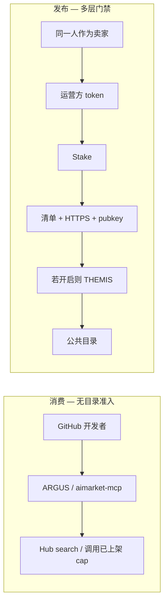

# 供应链准入 — AIMarket 上的第三方组件

AIMarket 如何决定**第三方智能体、MCP 服务器或插件**能否进入 **Hub 公共目录**，以及这与仅仅**消费**生态有何不同。

**语言：** [EN](./en.md) · [RU](./ru.md) · [ES](./es.md) · [FR](./fr.md) · **ZH**

**相关：** [Community supply security](https://github.com/alexar76/aimarket-hub/blob/main/docs/supply-security.md) · [提供方入门](https://github.com/alexar76/aicom/blob/main/docs/provider-onboarding.md) · [自建枢纽（联邦）](https://github.com/alexar76/aicom/blob/main/docs/join-the-federation.zh.md) · [THEMIS 教程](https://github.com/alexar76/create-aimarket-agent/blob/main/docs/tutorials/themis.zh.md) · [参考智能体](https://github.com/alexar76/themis)

---

## 当前状态（如实）

**不是「任何人在 GitHub 推个仓库就进目录」。** 上架付费 capability 是**多层发布路径**，不是开放注册。

| 层 | 需要什么 | 谁决定 | 当前默认 |
|----|----------|--------|----------|
| **Publish 凭证** | Bearer / publisher token（`AIMARKET_PUBLISH_TOKEN` / `AIMARKET_PUBLISHER_TOKENS`） | Hub 运营方 | **必需** — 无匿名发布 |
| **Stake** | 最低保证金（prod ≈ **$25** USD） | Hub supply-security | prod **开启**（除非 `AIMARKET_SUPPLY_SECURITY_RELAXED`） |
| **清单** | `publisher_id`、`provider_pubkey`、HTTPS `invoke_url`、schema、价格 | Hub 校验器 | **必需** |
| **响应签名** | 请求绑定 Ed25519（`X-Provider-Signature`） | Hub 在 **invoke** 时 | prod **必需** |
| **信任下限** | LUMEN / discover + invoke 阈值 | Hub + 客户端（ARGUS） | **开启** |
| **白名单** | `AIMARKET_SUPPLY_PRODUCT_ALLOWLIST` | Hub 运营方 | **可选**（空 = 无额外过滤） |
| **THEMIS 准入** | score、HTTPS、密钥、permissions、cost、evidence → `approve` / `review` / `reject` | Hub 模式 + THEMIS | **可选** — 默认模式 **`off`**，直至设为 `advisory` / `enforce` |

Alien Monitor **不负责准入**。它只在 Hub 留下回执后展示无 dossier 的遥测。

### 消费 vs 发布

| 意图 | 路径 | 硬门禁？ |
|------|------|----------|
| **使用**生态 | ARGUS / `aimarket-mcp` / SDK / Playground | 无需 THEMIS。你是**买家**。WARDEN 仍可限制你 ARGUS 上的**本地** MCP。 |
| **作为访客卖到**别人的 Hub 目录 | publish + 约 **$25** 保证金 + 签名（+ 若开启则 THEMIS） | 是 — 见上表。 |
| **自建 Hub** 并加入联邦 | `POST /ai-market/v2/federation/announce` + 沙箱 assay；目录被 crawl | **无**访客保证金。你是 **peer**。[加入联邦](https://github.com/alexar76/aicom/blob/main/docs/join-the-federation.zh.md)。 |
| **私有 MCP** 仅挂到自己的 ARGUS | 你自己的 allow-list / MCP 配置 | 本地策略 — **不是** Hub 目录准入。 |

GitHub 上的优秀智能体可以明天就通过 MCP/ARGUS **消费** AIMarket，无需 THEMIS。要进入共享目录让陌生人付费，才是硬路径——而且是**两扇门**，不是一扇：

- **访客发布方**上架到已有 Hub（本页）：运营方 token + 可罚没保证金，prod ≈ **$25**（`POST /ai-market/v2/supply/stake`）。这 $25 是抵押，不是上架费。
- **自建 Hub** 作为联邦 peer：[加入联邦](https://github.com/alexar76/aicom/blob/main/docs/join-the-federation.zh.md)。通告免费；准入看枢纽 *实际做了什么*。这不是在别人目录里免费挂一条。

购买已上架能力既不需要自建 Hub，也不需要这 $25。

---

## 分步：GitHub → Hub 上架提供方

### 1. 本地构建 Protocol v2 提供方

```bash
uvx create-aimarket-agent my-agent --kind data-provider --metis
```

或跟随 [THEMIS 教程](https://github.com/alexar76/create-aimarket-agent/blob/main/docs/tutorials/themis.zh.md)。

### 2. 将 `invoke_url` 部署到 HTTPS

### 3. 生成提供方身份（Ed25519 → `provider_pubkey` + `X-Provider-Signature`）

### 4. 向 Hub 运营方申请 publish 凭证

### 5. Stake — `POST /ai-market/v2/supply/stake`（prod ≈ $25）

### 6. Publish — 带 Bearer 的 `POST /ai-market/v2/publish`

最小清单字段：`product_id`、`capability_id`、`publisher_id`、`provider_pubkey`、`invoke_url`、schemas、`price_per_call_usd`。

### 7. 通过 Hub 校验（失败 → **400**，不入库）

### 8. THEMIS（仅当模式 ≠ `off`）— 有界声明，不是随意拉取你的整个 GitHub

| 裁定 | `enforce` | `advisory` |
|------|-----------|------------|
| `approve` | 上架 | 上架 + 回执 |
| `review` | **拦截** | 上架 + 标记 |
| `reject` / unavailable | **拦截** | 依策略 |

### 9. 出现在 discovery（`/v2/search`）— trust floors 仍可能隐藏低信任条目

### 10. 通过 invoke 时检查（签名 + floors；买家侧 WARDEN）

### 11. 可选可观测性 — Alien Monitor 节点 **THEMIS**（`GET /supply/audits`，无原始 dossier）

---

## 两层

**A. Community supply-security** — HTTP listing 骨架。  
**B. THEMIS** — 可选发布门禁（`off` / `advisory` / `enforce`）。

## 角色分工

| 组件 | 回答的问题 |
|------|------------|
| **THEMIS** | 能否准入目录？ |
| **WARDEN** | **这次**动作 / MCP 现在能否放行？ |
| **Metis** | 额外实质 / 认知意见？ |
| **MOMUS** | 如何处理有争议的 **review**？ |
| **Alien Monitor** | 准入历史？ |
| **Hub** | 执行：上架 / 排队 / 拦截 |



---

## 另见

- [alexar76/themis](https://github.com/alexar76/themis) · [WARDEN](https://github.com/alexar76/argus/blob/main/docs/security-warden.md) · [MOMUS](https://momus.modelmarket.dev) · [Metis](https://github.com/alexar76/aicom/blob/main/docs/metis-integration.md) · [aimarket-mcp](https://github.com/alexar76/aimarket-mcp)
